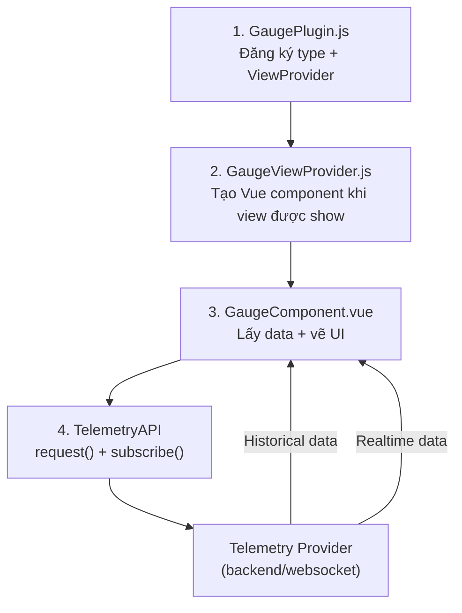
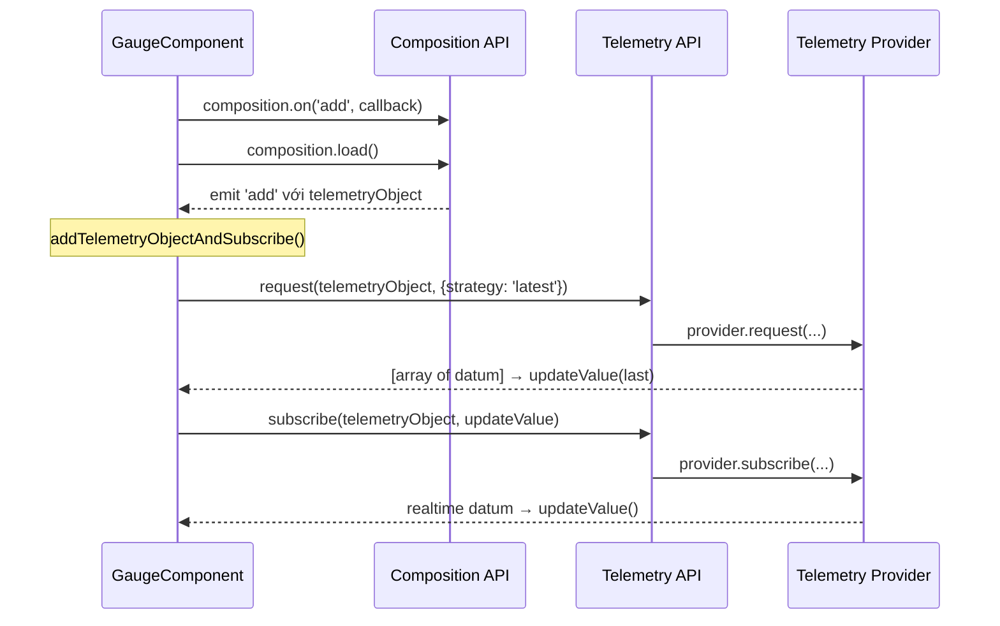

# Cách Gauge Chart trong Open MCT lấy data và vẽ lên màn hình

## Tổng quan kiến trúc

Luồng dữ liệu đi qua **4 tầng chính**:



---

## Bước 1: Đăng ký Plugin

[GaugePlugin.js](file:///d:/work/openmct/openmct/src/plugins/gauge/GaugePlugin.js) đăng ký mọi thứ cần thiết khi app khởi động:

```javascript
openmct.objectViews.addProvider(new GaugeViewProvider(openmct)); // View
openmct.types.addType('gauge', { ... });                         // Type definition
openmct.composition.addPolicy(new GaugeCompositionPolicy(...));  // Policy
```

Type definition cũng định nghĩa **cấu hình mặc định** (min, max, precision, gaugeType...) trong [initialize()](file:///d:/work/openmct/openmct/src/plugins/gauge/GaugePlugin.js#49-67).

---

## Bước 2: ViewProvider tạo Vue Component

Khi user mở một Gauge object, Open MCT tìm ViewProvider phù hợp qua [canView()](file:///d:/work/openmct/openmct/src/plugins/gauge/GaugeViewProvider.js#32-35). [GaugeViewProvider.js](file:///d:/work/openmct/openmct/src/plugins/gauge/GaugeViewProvider.js) trả về:

```javascript
canView(domainObject) {
  return domainObject.type === 'gauge'; // ← chỉ match type 'gauge'
}
```

Khi match, method [view().show()](file:///d:/work/openmct/openmct/src/plugins/gauge/GaugeViewProvider.js#40-73) được gọi → mount [GaugeComponent.vue](file:///d:/work/openmct/openmct/src/plugins/gauge/components/GaugeComponent.vue) với các **provide**:

| Provide | Vai trò |
|---------|---------|
| `openmct` | Instance chính, truy cập mọi API |
| `domainObject` | Object gauge hiện tại (chứa config) |
| [composition](file:///d:/work/openmct/openmct/src/ui/mixins/staleness-mixin.js#58-72) | `openmct.composition.get(domainObject)` — quản lý child objects |
| `renderWhenVisible` | Tối ưu: chỉ render khi component visible |

---

## Bước 3: GaugeComponent lấy dữ liệu

[GaugeComponent.vue](file:///d:/work/openmct/openmct/src/plugins/gauge/components/GaugeComponent.vue) là nơi **mọi logic data** xảy ra. Flow trong [mounted()](file:///d:/work/openmct/openmct/src/plugins/gauge/components/GaugeComponent.vue#547-561):



### 3a. Composition API — Tìm telemetry source

Gauge **không trực tiếp chứa telemetry data**. Nó chứa một **reference** tới telemetry object khác (thông qua `domainObject.composition`).

```javascript
// mounted()
this.composition.on('add', this.addedToComposition);
this.composition.load(); // → load children → emit 'add' cho mỗi child
```

[CompositionCollection.load()](file:///d:/work/openmct/openmct/src/api/composition/CompositionCollection.js#L210-L226) đọc danh sách identifier từ `domainObject.composition[]`, resolve thành domain objects, rồi emit `'add'` cho mỗi object.

### 3b. Request — Lấy dữ liệu historical

Khi nhận được telemetry object qua [addedToComposition()](file:///d:/work/openmct/openmct/src/plugins/gauge/components/GaugeComponent.vue#581-588), method [request()](file:///d:/work/openmct/openmct/src/plugins/gauge/components/GaugeComponent.vue#L650-L673) được gọi:

```javascript
request(domainObject) {
  // 1. Lấy metadata (tên fields, units, hints...)
  this.metadata = this.openmct.telemetry.getMetadata(domainObject);
  
  // 2. Tạo format map để format giá trị
  this.formats = this.openmct.telemetry.getFormatMap(this.metadata);
  
  // 3. Lấy limits (CRITICAL, WARNING, WATCH...)
  const LimitEvaluator = this.openmct.telemetry.getLimits(domainObject);
  LimitEvaluator.limits().then(this.updateLimits);
  
  // 4. Xác định valueKey (field nào chứa giá trị đo)
  this.valueKey = this.metadata.valuesForHints(['range'])[0].source;
  
  // 5. Request data mới nhất
  this.openmct.telemetry.request(domainObject, { strategy: 'latest' })
    .then(values => this.updateValue(values[values.length - 1]));
  
  // 6. Lấy đơn vị (unit)
  this.units = this.metadata.value(this.valueKey).unit || '';
}
```

`TelemetryAPI.request()` tìm **request provider** phù hợp, gửi request với time bounds, trả về array of telemetry datums.

### 3c. Subscribe — Nhận dữ liệu realtime

```javascript
subscribe(domainObject) {
  this.unsubscribe = this.openmct.telemetry.subscribe(
    domainObject,
    this.updateValue.bind(this)  // callback mỗi khi có data mới
  );
}
```

`TelemetryAPI.subscribe()` tìm **subscription provider** (thường là WebSocket), đăng ký callback. Mỗi khi có datum mới → [updateValue()](file:///d:/work/openmct/openmct/src/plugins/gauge/components/GaugeComponent.vue#732-754) được gọi.

### 3d. updateValue — Xử lý datum thành giá trị hiển thị

```javascript
updateValue(datum) {
  this.datum = datum;
  
  // Kiểm tra datum có trong time bounds không
  const { start, end } = this.openmct.time.getBounds();
  const parsedValue = this.timeFormatter.parse(this.datum);
  if (parsedValue < start || parsedValue > end) return;
  
  // Chỉ render khi component visible (tối ưu performance)
  this.renderWhenVisible(() => {
    this.curVal = this.round(
      this.formats[this.valueKey].format(this.datum), 
      this.precision
    );
  });
}
```

> [!IMPORTANT]
> `renderWhenVisible` là cơ chế tối ưu quan trọng — nếu gauge bị che (tab khác, scroll ra ngoài), nó sẽ **không render** cho đến khi visible lại. Lúc đó nó dùng giá trị mới nhất từ `this.datum`.

---

## Bước 4: Vẽ lên màn hình (SVG Rendering)

Khi [curVal](file:///d:/work/openmct/openmct/src/plugins/gauge/components/GaugeComponent.vue#541-546) thay đổi, Vue **reactive system** tự động cập nhật template. Gauge dùng **pure SVG** với CSS transforms:

### Dial (kim quay)

```
curVal → valToPercent() → percentToDegrees() → CSS rotate()
```

```javascript
valToPercent(value) {
  return ((value - rangeLow) / (rangeHigh - rangeLow)) * 100;
}

percentToDegrees(percent) {
  return (percent / 100) * 270 + DIAL_VALUE_DEG_OFFSET; // 270° arc
}
```

Kim quay được áp dụng qua SVG `transform: rotate(Xdeg)`:

```html
<g class="c-dial__needle-value" :style="`transform: rotate(${degValue}deg)`">
  <path d="..." />  <!-- Hình kim -->
</g>
```

### Meter (thanh ngang/dọc)

```
curVal → valToPercentMeter() → CSS translateX/Y
```

```html
<div class="c-meter__value" :style="`transform: translateY(${meterValueToPerc}%)`"></div>
```

### Hiển thị giá trị text

```html
<text class="c-dial__current-value-text">
  <tspan>{{ curVal }}</tspan>  <!-- Reactive binding -->
</text>
```

---

## Tóm tắt Pipeline hoàn chỉnh

```
User tạo Gauge → kéo telemetry object vào (composition)
                          ↓
              GaugePlugin đăng ký type + view
                          ↓
              ViewProvider mount GaugeComponent
                          ↓
              composition.load() → tìm telemetry source
                          ↓
         ┌────────────────┴────────────────┐
  telemetry.request()              telemetry.subscribe()
  (historical, latest)            (realtime, WebSocket)
         └────────────────┬────────────────┘
                          ↓
                   updateValue(datum)
                          ↓
              format + round → curVal
                          ↓
              Vue reactivity → SVG update
              (rotate kim / translate thanh)
```

## Các file chính đã nghiên cứu

| File | Vai trò |
|------|---------|
| [GaugePlugin.js](file:///d:/work/openmct/openmct/src/plugins/gauge/GaugePlugin.js) | Đăng ký type, view, policy, form |
| [GaugeViewProvider.js](file:///d:/work/openmct/openmct/src/plugins/gauge/GaugeViewProvider.js) | Tạo và mount Vue component |
| [GaugeComponent.vue](file:///d:/work/openmct/openmct/src/plugins/gauge/components/GaugeComponent.vue) | Logic data + SVG rendering |
| [TelemetryAPI.js](file:///d:/work/openmct/openmct/src/api/telemetry/TelemetryAPI.js) | API trung gian: request, subscribe, metadata |
| [CompositionCollection.js](file:///d:/work/openmct/openmct/src/api/composition/CompositionCollection.js) | Quản lý child objects |
| [staleness-mixin.js](file:///d:/work/openmct/openmct/src/ui/mixins/staleness-mixin.js) | Theo dõi data có bị stale không |
