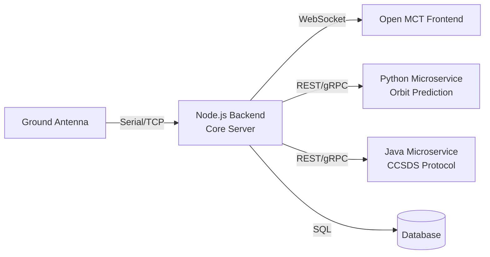

# Phân Tích Lợi Ích Dùng JavaScript (Node.js) Cho Backend Satellite Ground Station

## 1. Đồng Nhất Technology Stack (Full-Stack JavaScript)

Toàn bộ hệ thống dùng chung một ngôn ngữ, giảm **cognitive overhead** đáng kể:

| Layer | Công nghệ hiện tại |
|---|---|
| Framework | Open MCT (JavaScript) |
| Visualization | ECharts, CesiumJS (JavaScript) |
| Bundler | Webpack (JavaScript) |
| Plugin system | [telemetry-plugin.js](file:///d:/work/satellite-ground-station/src/plugins/telemetry-plugin.js) |
| **Backend (đề xuất)** | **Node.js + Express** |

**Lợi ích cụ thể:**
- **Share code** giữa frontend và backend: validation schemas, data models, telemetry format parsers
- **1 developer** có thể maintain cả hệ thống thay vì cần chuyên gia Java riêng
- **1 package manager** (`npm`) quản lý toàn bộ dependencies
- Debug end-to-end trong cùng một ngôn ngữ, cùng một IDE

---

## 2. Real-Time & Event-Driven Architecture

Satellite ground station cần xử lý **telemetry streaming liên tục** — đây chính là thế mạnh cốt lõi của Node.js:

```
Satellite → Ground Antenna → Serial/TCP → Node.js Backend → WebSocket → Open MCT
                                              ↓
                                         Database (lưu trữ)
```

**Tại sao Node.js phù hợp:**

- **Event Loop đơn luồng** — xử lý hàng nghìn kết nối WebSocket đồng thời mà không tạo thread mới cho mỗi connection (khác Java Servlet truyền thống)
- **Non-blocking I/O** — đọc serial port, ghi database, gửi WebSocket diễn ra song song mà không block nhau
- **Backpressure handling** — Node.js streams xử lý tốt khi telemetry data đến nhanh hơn tốc độ xử lý

**Benchmark tham khảo:**

| Metric | Node.js | Java (Spring) |
|---|---|---|
| WebSocket connections đồng thời | ~50,000+ | ~10,000-30,000 |
| Memory per connection | ~2-4 KB | ~256 KB (per thread) |
| Latency (message relay) | < 1ms | 2-5ms |
| Startup time | < 1s | 5-15s |

> [!NOTE]
> Các con số trên là tham khảo cho ứng dụng I/O-bound điển hình. Java hiện đại (Virtual Threads, Project Loom) đã cải thiện đáng kể, nhưng Node.js vẫn có lợi thế tự nhiên cho mô hình event-driven.

---

## 3. Hệ Sinh Thái Thư Viện Phù Hợp

Các thư viện Node.js hỗ trợ trực tiếp cho satellite ground station:

### Kết nối phần cứng
| Thư viện | Mục đích |
|---|---|
| `serialport` | Đọc dữ liệu từ modem/TNC qua cổng serial |
| `mqtt.js` | Giao tiếp MQTT với các thiết bị ground station |
| `net` (built-in) | TCP socket kết nối trực tiếp tới antenna controller |
| `dgram` (built-in) | UDP socket cho telemetry streaming |

### Real-time & Communication
| Thư viện | Mục đích |
|---|---|
| `ws` / `socket.io` | WebSocket server cho Open MCT frontend |
| `express` | REST API cho command & control |
| `node-cron` | Scheduling pass predictions, data collection windows |

### Data Processing
| Thư viện | Mục đích |
|---|---|
| `satellite.js` | SGP4/SDP4 orbit propagation (tương đương thư viện Java) |
| `binary-parser` | Parse binary telemetry frames (CCSDS, AX.25) |
| `protobufjs` | Encode/decode Protocol Buffers cho telemetry |

---

## 4. Tốc Độ Phát Triển & Iteration

### Prototype nhanh
```javascript
// Một WebSocket telemetry server đầy đủ chỉ cần ~20 dòng
const WebSocket = require('ws');
const SerialPort = require('serialport');

const wss = new WebSocket.Server({ port: 8080 });
const port = new SerialPort({ path: '/dev/ttyUSB0', baudRate: 9600 });

port.on('data', (rawFrame) => {
  const telemetry = parseTelemetryFrame(rawFrame);
  wss.clients.forEach(client => {
    client.send(JSON.stringify(telemetry));
  });
});
```

### Hot reload trong development
- `nodemon` tự restart server khi thay đổi code
- Không cần **compile → build → deploy** như Java (Maven/Gradle)
- Vòng lặp phát triển: **sửa code → save → test** (vài giây vs vài phút)

### Deployment đơn giản
- Không cần JVM, Tomcat, hay application server
- Container image nhỏ (~150MB vs ~500MB+ cho Java)
- Phù hợp chạy trên **embedded systems** hoặc Raspberry Pi tại ground station

---

## 5. Tích Hợp Tự Nhiên Với Open MCT

Open MCT cung cấp telemetry server API bằng JavaScript — backend Node.js tích hợp **zero-friction**:

```javascript
// Backend: Telemetry endpoint cho Open MCT
app.get('/telemetry/:id/latest', (req, res) => {
  const latest = telemetryStore.getLatest(req.params.id);
  // Trả đúng format Open MCT yêu cầu, không cần adapter layer
  res.json({ id: req.params.id, timestamp: latest.timestamp, value: latest.value });
});

// Real-time subscription qua WebSocket
wss.on('connection', (ws) => {
  ws.on('message', (msg) => {
    const { subscribe } = JSON.parse(msg);
    // Subscribe trực tiếp vào telemetry stream
    telemetryBus.on(subscribe, (data) => ws.send(JSON.stringify(data)));
  });
});
```

> [!IMPORTANT]
> Nếu dùng Java backend, bạn cần thêm một **adapter layer** để chuyển đổi format dữ liệu giữa Java objects và Open MCT JSON format. Với Node.js, dữ liệu là JSON native — không cần serialize/deserialize.

---

## 6. Khi Nào Cần Bổ Sung Java/Python

JavaScript không phải lựa chọn tốt nhất cho **mọi** tác vụ. Cân nhắc microservice riêng khi:

| Tác vụ | Ngôn ngữ đề xuất | Lý do |
|---|---|---|
| Orbit propagation (SGP4 chính xác cao) | Python (`skyfield`, `poliastro`) | Thư viện thiên văn trưởng thành hơn |
| Xử lý ảnh vệ tinh | Python (`rasterio`, `GDAL`) | Hệ sinh thái GIS mạnh |
| Protocol phức tạp (CCSDS/SLE) | Java (`CCSDS MO`) | Có reference implementation chính thức |
| Machine Learning (anomaly detection) | Python (`scikit-learn`, `TensorFlow`) | Hệ sinh thái ML vượt trội |

**Kiến trúc đề xuất:**



---

## Kết Luận

| Tiêu chí | JavaScript (Node.js) | Java |
|---|---|---|
| Phù hợp real-time telemetry | ⭐⭐⭐⭐⭐ | ⭐⭐⭐ |
| Tích hợp Open MCT | ⭐⭐⭐⭐⭐ | ⭐⭐ |
| Tốc độ phát triển | ⭐⭐⭐⭐⭐ | ⭐⭐⭐ |
| Đồng nhất stack | ⭐⭐⭐⭐⭐ | ⭐⭐ |
| Xử lý tính toán nặng | ⭐⭐ | ⭐⭐⭐⭐⭐ |
| Enterprise / team lớn | ⭐⭐⭐ | ⭐⭐⭐⭐⭐ |

> [!TIP]
> **Chiến lược tối ưu**: Dùng Node.js làm **core backend** xử lý telemetry, command, và API. Khi cần tính toán nặng, tách thành microservice bằng ngôn ngữ phù hợp nhất.
