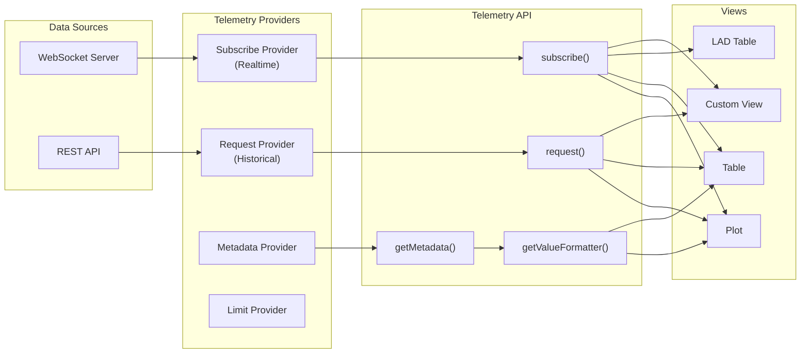

# Hướng dẫn sử dụng Telemetry API trong Open MCT

## 1. Tổng quan

Telemetry API là API cốt lõi để **thu thập, truy vấn và hiển thị dữ liệu đo lường** (telemetry) trong Open MCT. Nó hoạt động theo mô hình **Provider Pattern** — bạn đăng ký các provider, và OpenMCT sẽ tự động gọi provider phù hợp khi cần dữ liệu.



### Truy cập

```javascript
const telemetryAPI = openmct.telemetry;
```

---

## 2. Telemetry Provider

Provider là thành phần **cung cấp dữ liệu** cho OpenMCT. Một provider có thể implement một hoặc nhiều khả năng:

| Khả năng | Method cần implement | Mô tả |
|----------|---------------------|--------|
| **Request** | [supportsRequest()](file:///d:/work/satellite-ground-station/src/plugins/telemetry-plugin.js#7-10) + [request()](file:///d:/work/satellite-ground-station/src/plugins/telemetry-plugin.js#10-16) | Lấy dữ liệu lịch sử |
| **Subscribe** | [supportsSubscribe()](file:///d:/work/satellite-ground-station/src/plugins/telemetry-plugin.js#31-34) + [subscribe()](file:///d:/work/satellite-ground-station/node_modules/openmct/src/api/telemetry/TelemetryAPI.js#510-624) | Nhận dữ liệu realtime |
| **Metadata** | `supportsMetadata()` + [getMetadata()](file:///d:/work/satellite-ground-station/node_modules/openmct/src/api/telemetry/TelemetryAPI.js#775-796) | Mô tả cấu trúc dữ liệu |
| **Limits** | `supportsLimits()` + [getLimitEvaluator()](file:///d:/work/satellite-ground-station/node_modules/openmct/src/api/telemetry/TelemetryAPI.js#929-954) | Đánh giá ngưỡng cảnh báo |
| **Staleness** | `supportsStaleness()` + [isStale()](file:///d:/work/satellite-ground-station/node_modules/openmct/src/api/telemetry/TelemetryAPI.js#737-765) + [subscribeToStaleness()](file:///d:/work/satellite-ground-station/node_modules/openmct/src/api/telemetry/TelemetryAPI.js#625-681) | Theo dõi dữ liệu cũ/mất kết nối |

### Đăng ký Provider

```javascript
openmct.telemetry.addProvider(myProvider);
```

---

## 3. Request Provider (Dữ liệu lịch sử)

### Interface

```javascript
const historicalProvider = {
    // Kiểm tra provider này có hỗ trợ object này không
    supportsRequest(domainObject, options) {
        return domainObject.type === 'satellite.telemetry';
    },

    // Trả về Promise<Array<TelemetryDatum>>
    request(domainObject, options) {
        const { start, end, domain, strategy, size, signal } = options;

        const url = `/api/telemetry/${domainObject.identifier.key}`
            + `?start=${start}&end=${end}`;

        return fetch(url, { signal })      // signal hỗ trợ abort
            .then(resp => resp.json());
    }
};

openmct.telemetry.addProvider(historicalProvider);
```

### TelemetryRequestOptions

Khi gọi [request()](file:///d:/work/satellite-ground-station/src/plugins/telemetry-plugin.js#10-16), OpenMCT tự động bổ sung các options mặc định:

| Option | Type | Mô tả |
|--------|------|--------|
| `start` | `number` | Thời gian bắt đầu (ms epoch). Mặc định: `bounds.start` từ Time API |
| [end](file:///d:/work/satellite-ground-station/node_modules/openmct/src/api/time/TimeAPI.js#168-177) | `number` | Thời gian kết thúc. Mặc định: `bounds.end` |
| `domain` | `string` | Key của time system. Mặc định: time system hiện tại |
| `strategy` | `string` | Chiến lược: `'latest'`, `'minmax'`, etc. |
| `size` | `number` | Số lượng datum tối đa muốn lấy |
| [sort](file:///d:/work/satellite-ground-station/node_modules/openmct/src/api/telemetry/TelemetryCollection.js#289-310) | `string` | Key để sắp xếp. Prefix `+`/`-` cho ascending/descending |
| `signal` | `AbortSignal` | Signal để hủy request |
| `timeContext` | [TimeContext](file:///d:/work/satellite-ground-station/node_modules/openmct/src/api/time/TimeContext.js#71-693) | Time context (mặc định: global) |

### Gọi request từ code

```javascript
// Lấy dữ liệu lịch sử
const domainObject = await openmct.objects.get({
    namespace: 'satellite',
    key: 'eps.battery_voltage'
});

// Request với options tùy chỉnh
const data = await openmct.telemetry.request(domainObject, {
    start: Date.now() - 3600000,
    end: Date.now(),
    strategy: 'minmax',     // Lấy min/max để vẽ plot
    size: 1000              // Tối đa 1000 điểm
});

// Request giá trị mới nhất (LAD - Latest Available Datum)
const latest = await openmct.telemetry.request(domainObject, {
    strategy: 'latest',
    size: 1
});
```

---

## 4. Subscribe Provider (Dữ liệu Realtime)

### Interface

```javascript
const realtimeProvider = {
    supportsSubscribe(domainObject, options) {
        return domainObject.type === 'satellite.telemetry';
    },

    // Trả về hàm unsubscribe
    subscribe(domainObject, callback, options) {
        const key = domainObject.identifier.key;

        // Kết nối WebSocket, MQTT, etc.
        ws.send(JSON.stringify({ type: 'subscribe', key }));

        const handler = (event) => {
            const data = JSON.parse(event.data);
            if (data.id === key) {
                callback(data);  // Gọi callback với datum mới
            }
        };
        ws.addEventListener('message', handler);

        // Trả về hàm unsubscribe
        return function unsubscribe() {
            ws.removeEventListener('message', handler);
            ws.send(JSON.stringify({ type: 'unsubscribe', key }));
        };
    },

    // Optional: Hỗ trợ batch strategy
    supportsBatching(domainObject, options) {
        return true;
    }
};
```

### Subscribe Strategies

| Strategy | Constant | Callback nhận | Khi nào dùng |
|----------|----------|--------------|-------------|
| `'latest'` | `SUBSCRIBE_STRATEGY.LATEST` | Một datum duy nhất | LAD table, gauge, single value display |
| `'batch'` | `SUBSCRIBE_STRATEGY.BATCH` | Array of datums | Plot, table (cần **mọi** data point) |

```javascript
// Strategy: latest (mặc định)
const unsubscribe = openmct.telemetry.subscribe(
    domainObject,
    (datum) => {
        console.log('Latest value:', datum.value);
    }
);

// Strategy: batch (nhận tất cả data points)
const unsubBatch = openmct.telemetry.subscribe(
    domainObject,
    (datums) => {
        // datums là Array
        datums.forEach(d => console.log(d.value));
    },
    { strategy: openmct.telemetry.SUBSCRIBE_STRATEGY.BATCH }
);

// Hủy subscription
unsubscribe();
```

> [!IMPORTANT]
> **Subscription caching**: OpenMCT tự động cache subscriptions. Nếu nhiều view subscribe cùng một object với cùng options, chỉ **một** connection thực sự được tạo đến provider.

---

## 5. Telemetry Datum

Một **datum** là một điểm dữ liệu telemetry. Cấu trúc phụ thuộc vào metadata, nhưng thường có dạng:

```javascript
// Ví dụ datum cho satellite telemetry
{
    timestamp: 1741830000000,    // Unix ms (domain value)
    value: 28.5,                 // Giá trị đo (range value)
    id: 'eps.battery_voltage'    // Identifier
}

// Datum phức tạp hơn (nhiều giá trị)
{
    utc: 1741830000000,
    local_sclk: 123456789,
    temperature: 45.2,
    pressure: 1013.25,
    status: 'NOMINAL'
}
```

---

## 6. Telemetry Metadata

Metadata **mô tả cấu trúc** của telemetry datum — gồm những field nào, kiểu dữ liệu, format hiển thị, hints cho từng view.

### Metadata Provider

```javascript
const metadataProvider = {
    supportsMetadata(domainObject) {
        return domainObject.type === 'satellite.telemetry';
    },

    getMetadata(domainObject) {
        return {
            values: [
                {
                    key: 'utc',
                    name: 'Timestamp',
                    source: 'timestamp',      // key trong datum
                    format: 'utc',
                    hints: { domain: 1 }       // Đây là trục X (thời gian)
                },
                {
                    key: 'value',
                    name: 'Value',
                    format: 'float',
                    formatString: '%.2f',      // 2 chữ số thập phân
                    units: 'V',
                    hints: { range: 1 }        // Đây là trục Y (giá trị)
                },
                {
                    key: 'status',
                    name: 'Status',
                    format: 'enum',
                    enumerations: [
                        { value: 0, string: 'OFF' },
                        { value: 1, string: 'ON' },
                        { value: 2, string: 'ERROR' }
                    ],
                    hints: { range: 2 }
                }
            ]
        };
    }
};
```

### Value Metadata Hints

| Hint | Ý nghĩa | Ví dụ |
|------|---------|-------|
| `domain` | Trục X / Thời gian | Timestamp |
| `range` | Trục Y / Giá trị đo | Temperature, voltage |
| `priority` | Thứ tự ưu tiên | Tự động gán nếu không set |

### Sử dụng Metadata Manager

```javascript
// Lấy metadata manager
const metadata = openmct.telemetry.getMetadata(domainObject);

// Lấy tất cả value definitions
const allValues = metadata.values();

// Lấy domain values (timestamps)
const domains = metadata.valuesForHints(['domain']);

// Lấy range values (measurements)
const ranges = metadata.valuesForHints(['range']);

// Lấy metadata cho một key cụ thể
const voltageMetadata = metadata.value('value');

// Default display value
const defaultValue = metadata.getDefaultDisplayValue();
```

---

## 7. Value Formatter

Formatter chuyển đổi giá trị thô thành **chuỗi hiển thị** và ngược lại.

### Đăng ký Format mới

```javascript
openmct.telemetry.addFormat({
    key: 'celcius',
    format: (value) => `${value.toFixed(1)}°C`,
    parse: (text) => parseFloat(text),
    validate: (text) => !isNaN(parseFloat(text))
});

openmct.telemetry.addFormat({
    key: 'voltage',
    format: (value) => `${value.toFixed(2)} V`,
    parse: (text) => parseFloat(text),
    validate: (text) => !isNaN(parseFloat(text))
});
```

### Sử dụng Formatter

```javascript
const metadata = openmct.telemetry.getMetadata(domainObject);

// Lấy formatter cho một value
const valueMetadata = metadata.value('temperature');
const formatter = openmct.telemetry.getValueFormatter(valueMetadata);

// Format (number → string hiển thị)
const displayText = formatter.format(datum);    // "45.2°C"

// Parse (string → number)
const numericValue = formatter.parse(datum);    // 45.2

// Lấy format map cho tất cả values
const formatMap = openmct.telemetry.getFormatMap(metadata);
const tempDisplay = formatMap.temperature.format(datum);
const timeDisplay = formatMap.utc.format(datum);
```

---

## 8. Limits & Alarms

Limits cho phép **đánh giá mức cảnh báo** của telemetry (nominal, warning, critical...).

### Limit Provider

```javascript
const limitProvider = {
    supportsLimits(domainObject) {
        return domainObject.type === 'satellite.telemetry';
    },

    getLimitEvaluator(domainObject) {
        return {
            evaluate(datum, valueMetadata) {
                const value = datum[valueMetadata.key];

                if (value > 50) {
                    return {
                        cssClass: 'is-limit--upr is-limit--red',
                        name: 'RED HIGH',
                        low: 50,
                        high: Infinity
                    };
                }
                if (value > 40) {
                    return {
                        cssClass: 'is-limit--upr is-limit--yellow',
                        name: 'YELLOW HIGH',
                        low: 40,
                        high: 50
                    };
                }
                return undefined;  // Trong ngưỡng bình thường
            }
        };
    },

    getLimits(domainObject) {
        return {
            limits() {
                return Promise.resolve({
                    WARNING: {
                        low: { color: 'yellow', value: -10 },
                        high: { color: 'yellow', value: 40 }
                    },
                    CRITICAL: {
                        low: { color: 'red', value: -20 },
                        high: { color: 'red', value: 50 }
                    }
                });
            }
        };
    }
};
```

### Sử dụng Limits

```javascript
// Lấy limit evaluator
const evaluator = openmct.telemetry.getLimitEvaluator(domainObject);
const violation = evaluator.evaluate(datum, valueMetadata);

if (violation) {
    element.classList.add(violation.cssClass);
    console.warn(`Limit violation: ${violation.name}`);
}

// Lấy limit definitions (cho hiển thị trên plot)
const limitsObj = openmct.telemetry.getLimits(domainObject);
const limits = await limitsObj.limits();

// Subscribe to limit changes
const unsubLimits = openmct.telemetry.subscribeToLimits(
    domainObject,
    (newLimits) => {
        updateLimitLines(newLimits);
    }
);
```

---

## 9. Staleness (Dữ liệu cũ/mất kết nối)

Staleness cho biết khi telemetry **ngừng cập nhật** (mất tín hiệu, thiết bị offline...).

```javascript
// Kiểm tra staleness hiện tại
const stalenessInfo = await openmct.telemetry.isStale(domainObject);
// → { isStale: true, timestamp: 1741830000000 }

// Subscribe staleness updates
const unsubStale = openmct.telemetry.subscribeToStaleness(
    domainObject,
    ({ isStale, timestamp }) => {
        if (isStale) {
            element.classList.add('is-stale');
        } else {
            element.classList.remove('is-stale');
        }
    }
);
```

---

## 10. TelemetryCollection

[TelemetryCollection](file:///d:/work/satellite-ground-station/node_modules/openmct/src/api/telemetry/TelemetryCollection.js#47-554) là lớp **quản lý tự động** cả historical + realtime telemetry, tự động xử lý bounds, time system changes, và deduplication.

```javascript
// Tạo collection
const collection = openmct.telemetry.requestCollection(domainObject, {
    strategy: 'batch',
    size: 5000
});

// Lắng nghe events
collection.on('add', (addedDatums) => {
    console.log('New data:', addedDatums);
});

collection.on('remove', (removedDatums) => {
    console.log('Data removed (out of bounds):', removedDatums);
});

collection.on('clear', () => {
    console.log('Collection cleared (time system changed)');
});

// Load bắt đầu request historical + subscribe realtime
await collection.load();

// Lấy toàn bộ dữ liệu hiện tại trong bounds
const allData = collection.getAll();

// Destroy khi không cần nữa
collection.destroy();
```

> [!TIP]
> [TelemetryCollection](file:///d:/work/satellite-ground-station/node_modules/openmct/src/api/telemetry/TelemetryCollection.js#47-554) là cách **được khuyến nghị** để lấy telemetry trong custom views, vì nó tự động xử lý tất cả edge cases (bounds changes, time system changes, deduplication, sorting).

---

## 11. Request Interceptor

Interceptor cho phép **biến đổi request** trước khi gửi đến provider.

```javascript
openmct.telemetry.addRequestInterceptor({
    // Áp dụng cho request nào?
    appliesTo(identifier, request) {
        return identifier.namespace === 'satellite';
    },

    // Biến đổi request
    invoke(request) {
        // Thêm authentication token
        request.headers = {
            ...request.headers,
            'Authorization': `Bearer ${getToken()}`
        };

        // Giới hạn data points
        if (!request.size) {
            request.size = 10000;
        }

        return request;
    }
});
```

---

## 12. Ví dụ thực tế: Satellite Telemetry Provider đầy đủ

Dưới đây là provider hoàn chỉnh cho dự án satellite, bao gồm tất cả capabilities:

```javascript
export default function SatelliteTelemetryPlugin(config) {
    const { restUrl, wsUrl } = config;

    return function install(openmct) {
        const ws = new WebSocket(wsUrl);
        const listeners = {};

        ws.onmessage = (event) => {
            const data = JSON.parse(event.data);
            if (listeners[data.id]) {
                listeners[data.id].forEach(cb => cb(data));
            }
        };

        openmct.telemetry.addProvider({
            // ─── Request (Historical) ───
            supportsRequest(domainObject) {
                return domainObject.type === 'satellite.telemetry';
            },

            async request(domainObject, options) {
                const key = domainObject.identifier.key;
                const url = `${restUrl}/telemetry/${key}`
                    + `?start=${options.start}`
                    + `&end=${options.end}`
                    + (options.strategy ? `&strategy=${options.strategy}` : '')
                    + (options.size ? `&size=${options.size}` : '');

                const resp = await fetch(url, { signal: options.signal });
                return resp.json();
            },

            // ─── Subscribe (Realtime) ───
            supportsSubscribe(domainObject) {
                return domainObject.type === 'satellite.telemetry';
            },

            subscribe(domainObject, callback) {
                const key = domainObject.identifier.key;
                if (!listeners[key]) listeners[key] = [];
                listeners[key].push(callback);

                if (ws.readyState === WebSocket.OPEN) {
                    ws.send(JSON.stringify({ type: 'subscribe', key }));
                }

                return function unsubscribe() {
                    listeners[key] = listeners[key].filter(cb => cb !== callback);
                    if (listeners[key].length === 0) {
                        ws.send(JSON.stringify({ type: 'unsubscribe', key }));
                        delete listeners[key];
                    }
                };
            },

            // ─── Metadata ───
            supportsMetadata(domainObject) {
                return domainObject.type === 'satellite.telemetry';
            },

            getMetadata(domainObject) {
                return domainObject.telemetry;
                // telemetry metadata được lưu trong domainObject.telemetry
            },

            // ─── Limits ───
            supportsLimits(domainObject) {
                return domainObject.type === 'satellite.telemetry'
                    && domainObject.limits;
            },

            getLimitEvaluator(domainObject) {
                const limits = domainObject.limits;
                return {
                    evaluate(datum, valueMetadata) {
                        const value = datum[valueMetadata.source || valueMetadata.key];
                        const limitsForKey = limits[valueMetadata.key];
                        if (!limitsForKey) return undefined;

                        if (value >= limitsForKey.critical?.high) {
                            return {
                                cssClass: 'is-limit--upr is-limit--red',
                                name: 'RED HIGH'
                            };
                        }
                        if (value <= limitsForKey.critical?.low) {
                            return {
                                cssClass: 'is-limit--lwr is-limit--red',
                                name: 'RED LOW'
                            };
                        }
                        return undefined;
                    }
                };
            }
        });
    };
}
```

---

## 13. Tích hợp với React Hooks

Tham khảo cách sử dụng trong [useTelemetry.js](file:///d:/work/satellite-ground-station/src/plugins/react-panels/dashboard/hooks/useTelemetry.js):

```javascript
// Hook sử dụng TelemetryCollection (khuyến nghị)
export function useTelemetryCollection(key) {
    const openmct = useContext(OpenMCTContext);
    const [data, setData] = useState([]);

    useEffect(() => {
        if (!openmct || !key) return;

        const identifier = { namespace: 'satellite', key };
        let collection;

        openmct.objects.get(identifier).then((domainObject) => {
            collection = openmct.telemetry.requestCollection(domainObject, {
                strategy: 'batch',
                size: 5000
            });

            collection.on('add', (added) => {
                setData(prev => [...prev, ...added]);
            });

            collection.on('remove', (removed) => {
                setData(prev =>
                    prev.filter(d => !removed.includes(d))
                );
            });

            collection.on('clear', () => setData([]));

            collection.load();
        });

        return () => {
            if (collection) collection.destroy();
        };
    }, [openmct, key]);

    return data;
}
```

---

## 14. Utility Methods

```javascript
// Kiểm tra object có phải telemetry object không
openmct.telemetry.isTelemetryObject(domainObject);  // boolean

// Kiểm tra có provider nào hỗ trợ object này không
openmct.telemetry.canProvideTelemetry(domainObject);  // boolean

// Kiểm tra object có numeric telemetry không (cho plot)
openmct.telemetry.hasNumericTelemetry(domainObject);  // boolean

// Hủy tất cả pending requests
openmct.telemetry.abortAllRequests();

// Greedy LAD mode (mặc định: true)
// Khi true, trong realtime mode strategy "latest" sẽ bỏ qua start bound
openmct.telemetry.greedyLAD(false);
```

---

## 15. Tóm tắt API Reference

### Core Methods

| Method | Trả về | Mô tả |
|--------|--------|--------|
| [addProvider(provider)](file:///d:/work/satellite-ground-station/node_modules/openmct/src/api/telemetry/TelemetryAPI.js#156-184) | `void` | Đăng ký telemetry provider |
| [request(domainObject, options?)](file:///d:/work/satellite-ground-station/src/plugins/telemetry-plugin.js#10-16) | `Promise<Array>` | Lấy dữ liệu lịch sử |
| [subscribe(domainObject, callback, options?)](file:///d:/work/satellite-ground-station/node_modules/openmct/src/api/telemetry/TelemetryAPI.js#510-624) | `Function` (unsubscribe) | Subscribe dữ liệu realtime |
| [requestCollection(domainObject, options?)](file:///d:/work/satellite-ground-station/node_modules/openmct/src/api/telemetry/TelemetryAPI.js#434-450) | [TelemetryCollection](file:///d:/work/satellite-ground-station/node_modules/openmct/src/api/telemetry/TelemetryCollection.js#47-554) | Tạo managed collection |
| [getMetadata(domainObject)](file:///d:/work/satellite-ground-station/node_modules/openmct/src/api/telemetry/TelemetryAPI.js#775-796) | [TelemetryMetadataManager](file:///d:/work/satellite-ground-station/node_modules/openmct/src/api/telemetry/TelemetryMetadataManager.js#66-78) | Lấy metadata manager |
| [getValueFormatter(valueMetadata)](file:///d:/work/satellite-ground-station/node_modules/openmct/src/api/telemetry/TelemetryAPI.js#797-812) | [TelemetryValueFormatter](file:///d:/work/satellite-ground-station/node_modules/openmct/src/api/telemetry/TelemetryValueFormatter.js#27-147) | Lấy formatter cho 1 value |
| [getFormatMap(metadata)](file:///d:/work/satellite-ground-station/node_modules/openmct/src/api/telemetry/TelemetryAPI.js#823-848) | `Record<string, Formatter>` | Lấy formatter cho tất cả values |
| [addFormat(format)](file:///d:/work/satellite-ground-station/node_modules/openmct/src/api/telemetry/TelemetryAPI.js#883-890) | `void` | Đăng ký format mới |
| [getLimitEvaluator(domainObject)](file:///d:/work/satellite-ground-station/node_modules/openmct/src/api/telemetry/TelemetryAPI.js#929-954) | [LimitEvaluator](file:///d:/work/satellite-ground-station/node_modules/openmct/src/api/telemetry/TelemetryAPI.js#929-954) | Lấy limit evaluator |
| [getLimits(domainObject)](file:///d:/work/satellite-ground-station/node_modules/openmct/src/api/telemetry/TelemetryAPI.js#955-1000) | `LimitsResponseObject` | Lấy limit definitions |
| [subscribeToLimits(domainObject, cb)](file:///d:/work/satellite-ground-station/node_modules/openmct/src/api/telemetry/TelemetryAPI.js#682-736) | `Function` | Subscribe limit changes |
| [isStale(domainObject)](file:///d:/work/satellite-ground-station/node_modules/openmct/src/api/telemetry/TelemetryAPI.js#737-765) | `Promise<StalenessResponse>` | Kiểm tra staleness |
| [subscribeToStaleness(domainObject, cb)](file:///d:/work/satellite-ground-station/node_modules/openmct/src/api/telemetry/TelemetryAPI.js#625-681) | `Function` | Subscribe staleness |
| [addRequestInterceptor(def)](file:///d:/work/satellite-ground-station/node_modules/openmct/src/api/telemetry/TelemetryAPI.js#371-382) | `void` | Đăng ký request interceptor |
| [isTelemetryObject(domainObject)](file:///d:/work/satellite-ground-station/node_modules/openmct/src/api/telemetry/TelemetryAPI.js#128-139) | `boolean` | Kiểm tra có telemetry metadata |
| [canProvideTelemetry(domainObject)](file:///d:/work/satellite-ground-station/node_modules/openmct/src/api/telemetry/TelemetryAPI.js#140-155) | `boolean` | Kiểm tra có provider hỗ trợ |

### TelemetryCollection Events

| Event | Callback | Mô tả |
|-------|----------|--------|
| [add](file:///d:/work/satellite-ground-station/node_modules/openmct/src/api/time/TimeAPI.js#121-128) | [(addedDatums)](file:///d:/work/satellite-ground-station/node_modules/openmct/src/api/time/TimeContext.js#413-416) | Có dữ liệu mới trong bounds |
| [remove](file:///d:/work/satellite-ground-station/node_modules/openmct/src/api/time/IndependentTimeContext.js#496-540) | [(removedDatums)](file:///d:/work/satellite-ground-station/node_modules/openmct/src/api/time/TimeContext.js#413-416) | Dữ liệu bị loại khỏi bounds |
| `clear` | [()](file:///d:/work/satellite-ground-station/node_modules/openmct/src/api/time/TimeContext.js#413-416) | Collection bị reset (time system change) |

### Subscribe Strategy Constants

```javascript
openmct.telemetry.SUBSCRIBE_STRATEGY.LATEST   // 'latest'
openmct.telemetry.SUBSCRIBE_STRATEGY.BATCH     // 'batch'
```

> [!WARNING]
> Luôn gọi [unsubscribe()](file:///d:/work/satellite-ground-station/node_modules/openmct/src/api/telemetry/TelemetryAPI.js#720-721) khi không còn cần subscription để tránh memory leak. Trong React, đặt trong cleanup function của `useEffect`.
