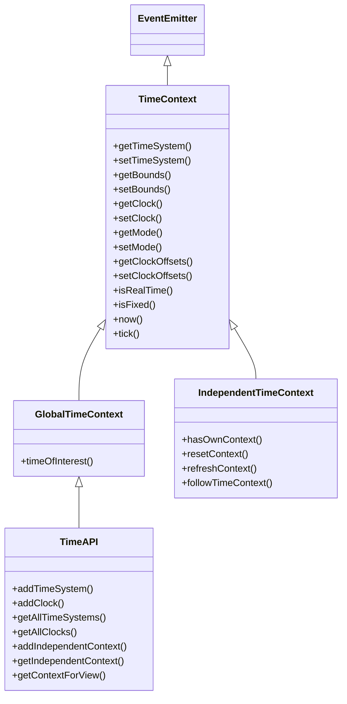

# Hướng dẫn sử dụng Time API trong Open MCT

## 1. Tổng quan kiến trúc

Time API là thành phần cốt lõi quản lý **trạng thái thời gian** của toàn bộ ứng dụng Open MCT. Mọi view hiển thị dữ liệu telemetry đều phụ thuộc vào Time API để biết **khoảng thời gian nào cần hiển thị**.

### Hệ thống phân cấp (Inheritance)



### Truy cập

```javascript
// Time API được truy cập qua openmct.time
const timeAPI = openmct.time;
```

---

## 2. Hai chế độ hoạt động (Modes)

| Mode | Key | Mô tả |
|------|-----|--------|
| **Fixed** | `'fixed'` | Hiển thị dữ liệu trong khoảng thời gian **cố định** (start → end). Không tự cập nhật |
| **Realtime** | `'realtime'` | Hiển thị dữ liệu **theo thời gian thực**, cửa sổ thời gian tự động trượt theo clock |

### Kiểm tra mode hiện tại

```javascript
openmct.time.getMode();     // 'fixed' hoặc 'realtime'
openmct.time.isRealTime();  // true/false
openmct.time.isFixed();     // true/false
```

### Chuyển đổi mode

```javascript
// Chuyển sang Fixed mode với bounds cụ thể
openmct.time.setMode('fixed', {
    start: Date.now() - 3600000,  // 1 giờ trước
    end: Date.now()
});

// Chuyển sang Realtime mode với clock offsets
openmct.time.setMode('realtime', {
    start: -900000,  // 15 phút trước "now" (giá trị âm, bắt buộc < 0)
    end: 30000       // 30 giây sau "now" (giá trị dương, bắt buộc >= 0)
});
```

---

## 3. Time System

**Time System** định nghĩa **đơn vị thời gian** mà ứng dụng sử dụng.

- Mặc định: **UTC** (milliseconds kể từ Unix epoch)
- Có thể mở rộng: ví dụ "sols" cho sứ mệnh sao Hỏa

### Đăng ký Time System mới

```javascript
openmct.time.addTimeSystem({
    key: 'utc',
    name: 'UTC',
    cssClass: 'icon-clock',
    timeFormat: 'utc',           // Key của format hiển thị timestamp
    durationFormat: 'duration'    // Key của format hiển thị duration
});
```

### Get/Set Time System

```javascript
// Lấy time system hiện tại
const currentSystem = openmct.time.getTimeSystem();
// → { key: 'utc', name: 'UTC', ... }

// Đặt time system (có thể kèm bounds)
openmct.time.setTimeSystem('utc', {
    start: Date.now() - 3600000,
    end: Date.now()
});
```

### Liệt kê tất cả Time Systems

```javascript
const allSystems = openmct.time.getAllTimeSystems();
```

---

## 4. Bounds (Khoảng thời gian hiển thị)

**Bounds** xác định cửa sổ thời gian `{ start, end }` — quyết định dữ liệu nào được hiển thị.

```javascript
// Lấy bounds hiện tại
const bounds = openmct.time.getBounds();
console.log(bounds.start, bounds.end);

// Đặt bounds mới (chỉ dùng trong Fixed mode)
openmct.time.setBounds({
    start: Date.now() - 7200000,  // 2 giờ trước
    end: Date.now()
});
```

> [!IMPORTANT]
> `start` **phải** nhỏ hơn [end](file:///d:/work/satellite-ground-station/node_modules/openmct/src/api/time/TimeAPI.js#168-177). Nếu không, sẽ throw Error.

### Validate trước khi set

```javascript
const result = openmct.time.validateBounds({ start: 100, end: 50 });
// → { valid: false, message: 'Start bound must be less than end bound' }
```

---

## 5. Clock & Clock Offsets

**Clock** là nguồn tick tự động — cập nhật bounds liên tục trong Realtime mode.

### Đăng ký Clock

```javascript
openmct.time.addClock({
    key: 'local',
    name: 'Local Clock',
    description: 'Ticking based on local system time',
    currentValue: () => Date.now()
});
```

### Get/Set Clock

```javascript
// Lấy clock hiện tại
const clock = openmct.time.getClock();

// Set clock (clock phải đã được đăng ký trước đó)
openmct.time.setClock('local');

// Liệt kê tất cả clocks
const allClocks = openmct.time.getAllClocks();
```

### Clock Offsets

Khi ở Realtime mode, **offsets** xác định cửa sổ thời gian **tương đối** so với giá trị "now" của clock:

```
bounds.start = clock.currentValue() + offsets.start
bounds.end   = clock.currentValue() + offsets.end
```

```javascript
// Lấy offsets hiện tại
const offsets = openmct.time.getClockOffsets();

// Đặt offsets mới (hiển thị 30 phút trước → 1 phút sau "now")
openmct.time.setClockOffsets({
    start: -1800000,  // -30 phút (phải < 0)
    end: 60000        // +1 phút (phải >= 0)
});
```

### Lấy thời gian hiện tại từ Clock

```javascript
const now = openmct.time.now();
// → Unix timestamp (ms)
```

---

## 6. Events (Sự kiện)

Time API kế thừa `EventEmitter`, cho phép lắng nghe các thay đổi thời gian:

| Event | Callback signature | Khi nào phát |
|-------|-------------------|-------------|
| `boundsChanged` | [(bounds, isTick)](file:///d:/work/satellite-ground-station/node_modules/openmct/src/api/time/IndependentTimeContext.js#385-396) | Bounds thay đổi. `isTick=true` nếu do clock tick |
| `clockChanged` | [(clock)](file:///d:/work/satellite-ground-station/node_modules/openmct/src/api/time/IndependentTimeContext.js#385-396) | Clock thay đổi |
| `timeSystemChanged` | [(timeSystem)](file:///d:/work/satellite-ground-station/node_modules/openmct/src/api/time/IndependentTimeContext.js#385-396) | Time system thay đổi |
| `modeChanged` | [(mode)](file:///d:/work/satellite-ground-station/node_modules/openmct/src/api/time/IndependentTimeContext.js#385-396) | Mode thay đổi (`'fixed'` ↔ `'realtime'`) |
| `clockOffsetsChanged` | [(offsets)](file:///d:/work/satellite-ground-station/node_modules/openmct/src/api/time/IndependentTimeContext.js#385-396) | Clock offsets thay đổi |
| [tick](file:///d:/work/satellite-ground-station/node_modules/openmct/src/api/time/IndependentTimeContext.js#101-111) | [(timestamp)](file:///d:/work/satellite-ground-station/node_modules/openmct/src/api/time/IndependentTimeContext.js#385-396) | Mỗi lần clock tick (luôn phát, bất kể mode) |
| [timeOfInterest](file:///d:/work/satellite-ground-station/node_modules/openmct/src/api/time/GlobalTimeContext.js#80-102) | [(toi)](file:///d:/work/satellite-ground-station/node_modules/openmct/src/api/time/IndependentTimeContext.js#385-396) | Time of Interest thay đổi |

### Cách sử dụng Events

```javascript
// Lắng nghe bounds thay đổi
function handleBoundsChange(bounds, isTick) {
    console.log(`Bounds: ${new Date(bounds.start)} → ${new Date(bounds.end)}`);
    if (isTick) {
        console.log('(Auto-updated by clock)');
    }
}

openmct.time.on('boundsChanged', handleBoundsChange);

// Hủy lắng nghe khi không cần nữa
openmct.time.off('boundsChanged', handleBoundsChange);
```

```javascript
// Lắng nghe mode thay đổi
openmct.time.on('modeChanged', (mode) => {
    if (mode === 'realtime') {
        console.log('Switched to realtime');
    } else {
        console.log('Switched to fixed');
    }
});

// Lắng nghe từng tick (hữu ích cho animation)
openmct.time.on('tick', (timestamp) => {
    updateClock(timestamp);
});
```

---

## 7. Time of Interest (TOI)

**TOI** là một điểm thời gian duy nhất — "con trỏ thời gian" mà người dùng quan tâm. Khi click vào một điểm trên biểu đồ, TOI sẽ được set tại điểm đó.

```javascript
// Lấy TOI hiện tại
const toi = openmct.time.timeOfInterest();

// Set TOI
openmct.time.timeOfInterest(Date.now() - 60000);  // 1 phút trước

// Xóa TOI
openmct.time.timeOfInterest(undefined);

// Lắng nghe thay đổi TOI
openmct.time.on('timeOfInterest', (newTOI) => {
    if (newTOI !== undefined) {
        highlightDataAt(newTOI);
    }
});
```

> [!NOTE]
> TOI tự động bị xóa (`undefined`) nếu bounds thay đổi mà TOI nằm ngoài `[start, end]`.

---

## 8. Independent Time Context

Cho phép một view cụ thể có **khoảng thời gian riêng**, không đồng bộ với Global Time Context.

### Tạo Independent Context

```javascript
// Lấy time context cho một view
const timeContext = openmct.time.getContextForView(objectPath);

// Tạo independent context (tách khỏi global)
const destroyContext = openmct.time.addIndependentContext(
    keyString,           // Key string của domain object
    boundsOrOffsets,     // Bounds (fixed) hoặc Offsets (realtime)
    clockKey             // Key của clock (optional, nếu có → realtime mode)
);

// Kiểm tra context có phải independent không
timeContext.hasOwnContext();  // true nếu là independent

// Hủy independent context (quay về theo global)
destroyContext();
```

### Ví dụ: View với thời gian riêng

```javascript
// View A hiển thị 1 giờ gần nhất (realtime, independent)
const cleanup = openmct.time.addIndependentContext(
    'satellite:panel-A',
    { start: -3600000, end: 30000 },  // offsets
    'local'                            // clock key → realtime mode
);

// View B vẫn theo global time context (mặc định)
```

---

## 9. Ví dụ thực tế trong dự án Satellite

### 9.1 Cải tiến hook [useTelemetryHistory](file:///d:/work/satellite-ground-station/src/plugins/react-panels/dashboard/hooks/useTelemetry.js#100-145) sử dụng Time API

Hiện tại trong [useTelemetry.js](file:///d:/work/satellite-ground-station/src/plugins/react-panels/dashboard/hooks/useTelemetry.js), [useTelemetryHistory](file:///d:/work/satellite-ground-station/src/plugins/react-panels/dashboard/hooks/useTelemetry.js#100-145) dùng `Date.now()` trực tiếp. Có thể cải tiến bằng Time API:

```javascript
export function useTelemetryHistory(keys, durationMs = 60000) {
    const openmct = useContext(OpenMCTContext);
    const [history, setHistory] = useState({});

    useEffect(() => {
        if (!openmct || !keys.length) return;

        const unsubscribes = [];

        // ✅ Dùng bounds từ Time API thay vì Date.now()
        const bounds = openmct.time.getBounds();

        keys.forEach((key) => {
            const identifier = { namespace: 'satellite', key };

            openmct.objects.get(identifier).then((domainObject) => {
                openmct.telemetry.request(domainObject, {
                    start: bounds.start,
                    end: bounds.end,
                }).then((data) => {
                    setHistory(prev => ({ ...prev, [key]: data || [] }));
                });

                const unsub = openmct.telemetry.subscribe(domainObject, (datum) => {
                    setHistory(prev => {
                        const existing = prev[key] || [];
                        const currentBounds = openmct.time.getBounds();
                        const filtered = existing.filter(
                            d => d.timestamp > currentBounds.start
                        );
                        return { ...prev, [key]: [...filtered, datum] };
                    });
                });
                unsubscribes.push(unsub);
            });
        });

        // ✅ Lắng nghe bounds thay đổi để tự động reload
        const handleBoundsChange = (newBounds, isTick) => {
            if (!isTick) {
                // Chỉ reload khi user thay đổi bounds thủ công
                // (không reload khi clock tick để tránh spam requests)
                keys.forEach((key) => {
                    const identifier = { namespace: 'satellite', key };
                    openmct.objects.get(identifier).then((domainObject) => {
                        openmct.telemetry.request(domainObject, {
                            start: newBounds.start,
                            end: newBounds.end,
                        }).then((data) => {
                            setHistory(prev => ({ ...prev, [key]: data || [] }));
                        });
                    });
                });
            }
        };
        openmct.time.on('boundsChanged', handleBoundsChange);

        return () => {
            unsubscribes.forEach(fn => fn());
            openmct.time.off('boundsChanged', handleBoundsChange);
        };
    }, [openmct, keys.join(',')]);

    return history;
}
```

### 9.2 Hook lắng nghe Time Context

```javascript
/**
 * Hook theo dõi trạng thái thời gian của OpenMCT
 */
export function useTimeContext() {
    const openmct = useContext(OpenMCTContext);
    const [bounds, setBounds] = useState({ start: 0, end: 0 });
    const [mode, setMode] = useState('fixed');
    const [isRealtime, setIsRealtime] = useState(false);

    useEffect(() => {
        if (!openmct) return;

        // Khởi tạo giá trị ban đầu
        setBounds(openmct.time.getBounds());
        setMode(openmct.time.getMode());
        setIsRealtime(openmct.time.isRealTime());

        // Lắng nghe thay đổi
        const onBoundsChanged = (newBounds) => setBounds(newBounds);
        const onModeChanged = (newMode) => {
            setMode(newMode);
            setIsRealtime(newMode === 'realtime');
        };

        openmct.time.on('boundsChanged', onBoundsChanged);
        openmct.time.on('modeChanged', onModeChanged);

        return () => {
            openmct.time.off('boundsChanged', onBoundsChanged);
            openmct.time.off('modeChanged', onModeChanged);
        };
    }, [openmct]);

    return { bounds, mode, isRealtime };
}
```

### 9.3 Cấu hình Time Conductor khi khởi tạo plugin

```javascript
export default function SatelliteTimePlugin() {
    return function install(openmct) {
        // Đăng ký time system
        openmct.time.addTimeSystem({
            key: 'utc',
            name: 'UTC',
            timeFormat: 'utc',
            durationFormat: 'duration'
        });

        // Cấu hình mặc định
        openmct.time.setTimeSystem('utc');

        // Chế độ realtime, hiển thị 15 phút gần nhất
        openmct.time.setClock('local');
        openmct.time.setMode('realtime', {
            start: -900000,   // -15 phút
            end: 30000        // +30 giây
        });
    };
}
```

---

## 10. Tóm tắt API Methods

### Trên `openmct.time` (TimeAPI)

| Method | Mô tả |
|--------|--------|
| [addTimeSystem(ts)](file:///d:/work/satellite-ground-station/node_modules/openmct/src/api/time/TimeAPI.js#90-98) | Đăng ký time system mới |
| [getAllTimeSystems()](file:///d:/work/satellite-ground-station/node_modules/openmct/src/api/time/TimeAPI.js#99-105) | Lấy danh sách tất cả time systems |
| [getTimeSystem()](file:///d:/work/satellite-ground-station/node_modules/openmct/src/api/time/TimeContext.js#417-424) | Lấy time system đang dùng |
| [setTimeSystem(key, bounds?)](file:///d:/work/satellite-ground-station/node_modules/openmct/src/api/time/TimeContext.js#425-470) | Đặt time system |
| [addClock(clock)](file:///d:/work/satellite-ground-station/node_modules/openmct/src/api/time/TimeAPI.js#121-128) | Đăng ký clock mới |
| [getAllClocks()](file:///d:/work/satellite-ground-station/node_modules/openmct/src/api/time/TimeAPI.js#129-135) | Lấy danh sách tất cả clocks |
| [getClock()](file:///d:/work/satellite-ground-station/node_modules/openmct/src/api/time/TimeContext.js#507-514) | Lấy clock đang active |
| [setClock(key)](file:///d:/work/satellite-ground-station/node_modules/openmct/src/api/time/TimeContext.js#515-554) | Đặt clock active |
| [getBounds()](file:///d:/work/satellite-ground-station/node_modules/openmct/src/api/time/TimeContext.js#471-480) | Lấy bounds `{start, end}` |
| [setBounds(bounds)](file:///d:/work/satellite-ground-station/node_modules/openmct/src/api/time/IndependentTimeContext.js#90-100) | Đặt bounds |
| [getMode()](file:///d:/work/satellite-ground-station/node_modules/openmct/src/api/time/TimeContext.js#555-562) | Lấy mode (`'fixed'`/`'realtime'`) |
| [setMode(mode, offsetsOrBounds?)](file:///d:/work/satellite-ground-station/node_modules/openmct/src/api/time/IndependentTimeContext.js#308-360) | Đặt mode |
| [getClockOffsets()](file:///d:/work/satellite-ground-station/node_modules/openmct/src/api/time/IndependentTimeContext.js#123-133) | Lấy clock offsets `{start, end}` |
| [setClockOffsets(offsets)](file:///d:/work/satellite-ground-station/node_modules/openmct/src/api/time/IndependentTimeContext.js#134-144) | Đặt clock offsets |
| [isRealTime()](file:///d:/work/satellite-ground-station/node_modules/openmct/src/api/time/IndependentTimeContext.js#361-372) | Check realtime mode |
| [isFixed()](file:///d:/work/satellite-ground-station/node_modules/openmct/src/api/time/IndependentTimeContext.js#373-384) | Check fixed mode |
| [now()](file:///d:/work/satellite-ground-station/node_modules/openmct/src/api/time/IndependentTimeContext.js#385-396) | Lấy timestamp hiện tại từ clock |
| [timeOfInterest(toi?)](file:///d:/work/satellite-ground-station/node_modules/openmct/src/api/time/GlobalTimeContext.js#80-102) | Get/Set Time of Interest |
| [getContextForView(objectPath)](file:///d:/work/satellite-ground-station/node_modules/openmct/src/api/time/TimeAPI.js#178-218) | Lấy time context cho view |
| [addIndependentContext(...)](file:///d:/work/satellite-ground-station/node_modules/openmct/src/api/time/TimeAPI.js#136-167) | Tạo independent time context |

### Events

| Event | Callback |
|-------|----------|
| `boundsChanged` | [(bounds, isTick)](file:///d:/work/satellite-ground-station/node_modules/openmct/src/api/time/IndependentTimeContext.js#385-396) |
| `clockChanged` | [(clock)](file:///d:/work/satellite-ground-station/node_modules/openmct/src/api/time/IndependentTimeContext.js#385-396) |
| `timeSystemChanged` | [(timeSystem)](file:///d:/work/satellite-ground-station/node_modules/openmct/src/api/time/IndependentTimeContext.js#385-396) |
| `modeChanged` | [(mode)](file:///d:/work/satellite-ground-station/node_modules/openmct/src/api/time/IndependentTimeContext.js#385-396) |
| `clockOffsetsChanged` | [(offsets)](file:///d:/work/satellite-ground-station/node_modules/openmct/src/api/time/IndependentTimeContext.js#385-396) |
| [tick](file:///d:/work/satellite-ground-station/node_modules/openmct/src/api/time/IndependentTimeContext.js#101-111) | [(timestamp)](file:///d:/work/satellite-ground-station/node_modules/openmct/src/api/time/IndependentTimeContext.js#385-396) |
| [timeOfInterest](file:///d:/work/satellite-ground-station/node_modules/openmct/src/api/time/GlobalTimeContext.js#80-102) | [(toi)](file:///d:/work/satellite-ground-station/node_modules/openmct/src/api/time/IndependentTimeContext.js#385-396) |

> [!WARNING]
> Các method cũ ([bounds()](file:///d:/work/satellite-ground-station/node_modules/openmct/src/api/time/IndependentTimeContext.js#67-78), [clock()](file:///d:/work/satellite-ground-station/node_modules/openmct/src/api/time/TimeContext.js#325-385), [clockOffsets()](file:///d:/work/satellite-ground-station/node_modules/openmct/src/api/time/TimeContext.js#274-312), [timeSystem()](file:///d:/work/satellite-ground-station/node_modules/openmct/src/api/time/TimeContext.js#114-178), [stopClock()](file:///d:/work/satellite-ground-station/node_modules/openmct/src/api/time/TimeContext.js#313-324)) **đã deprecated**. Hãy dùng các method get/set mới tương ứng.
