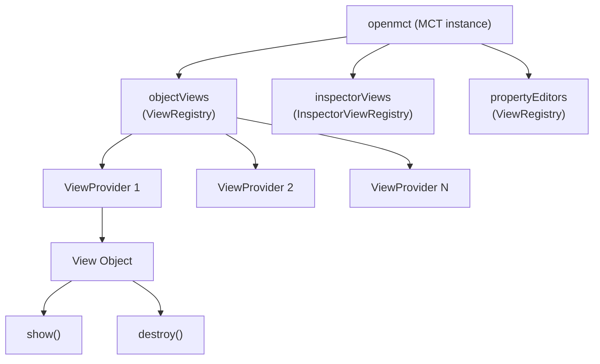
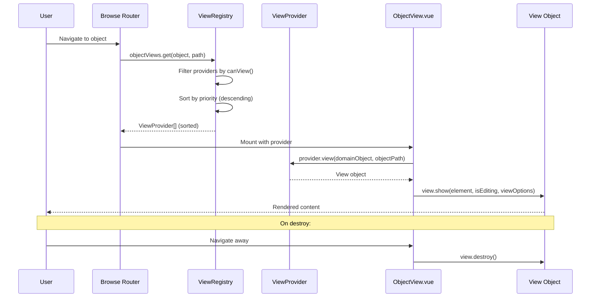

# Tổng Hợp API View Trong Open MCT

## 1. Tổng Quan Kiến Trúc View

Open MCT có **3 View Registries** chính, đều được khởi tạo trong [MCT.js](file:///d:/work/satellite-ground-station/node_modules/openmct/src/MCT.js):

| Registry | Thuộc tính | Mô tả |
|---|---|---|
| `openmct.objectViews` | [ViewRegistry](file:///d:/work/satellite-ground-station/node_modules/openmct/src/ui/registries/ViewRegistry.js#31-123) | Views hiển thị trong **khu vực chính** (main viewing area) |
| `openmct.inspectorViews` | [InspectorViewRegistry](file:///d:/work/satellite-ground-station/node_modules/openmct/src/ui/registries/InspectorViewRegistry.js#29-103) | Views hiển thị trong **Inspector panel** (dựa trên selection) |
| `openmct.propertyEditors` | [ViewRegistry](file:///d:/work/satellite-ground-station/node_modules/openmct/src/ui/registries/ViewRegistry.js#31-123) | Views trong **Edit Properties** dialogs |



---

## 2. ViewRegistry API

Source: [ViewRegistry.js](file:///d:/work/satellite-ground-station/node_modules/openmct/src/ui/registries/ViewRegistry.js)

> [!NOTE]
> [ViewRegistry](file:///d:/work/satellite-ground-station/node_modules/openmct/src/ui/registries/ViewRegistry.js#31-123) extends `EventEmitter`, cho phép emit/listen events như [clearData](file:///d:/work/satellite-ground-station/node_modules/openmct/src/ui/components/ObjectView.vue#498-516), [reload](file:///d:/work/satellite-ground-station/node_modules/openmct/src/ui/components/ObjectView.vue#235-242), `contextAction`.

### Phương thức chính

| Phương thức | Signature | Mô tả |
|---|---|---|
| [addProvider](file:///d:/work/satellite-ground-station/node_modules/openmct/src/ui/registries/ViewRegistry.js#72-102) | [(provider: ViewProvider) => void](file:///d:/work/satellite-ground-station/node_modules/openmct/src/MCT.js#76-437) | Đăng ký một ViewProvider mới |
| [get](file:///d:/work/satellite-ground-station/node_modules/openmct/src/ui/registries/InspectorViewRegistry.js#35-62) | [(item: DomainObject, objectPath: ObjectPath) => ViewProvider[]](file:///d:/work/satellite-ground-station/node_modules/openmct/src/MCT.js#76-437) | Lấy danh sách providers phù hợp, **đã sắp xếp theo priority giảm dần** |
| [getByProviderKey](file:///d:/work/satellite-ground-station/node_modules/openmct/src/ui/registries/ViewRegistry.js#103-111) | [(key: string) => ViewProvider](file:///d:/work/satellite-ground-station/node_modules/openmct/src/MCT.js#76-437) | Lấy provider theo key |

### Sử dụng

```javascript
// Đăng ký view provider
openmct.objectViews.addProvider(myViewProvider);

// Lấy tất cả views có thể hiển thị cho object
const views = openmct.objectViews.get(domainObject, objectPath);

// Lấy view provider theo key
const provider = openmct.objectViews.getByProviderKey('my-custom-view');
```

### Events (thông qua EventEmitter)

| Event | Mô tả |
|---|---|
| [clearData](file:///d:/work/satellite-ground-station/node_modules/openmct/src/ui/components/ObjectView.vue#498-516) | Xóa dữ liệu của view (triggered bởi ClearDataAction) |
| [reload](file:///d:/work/satellite-ground-station/node_modules/openmct/src/ui/components/ObjectView.vue#235-242) | Reload view (triggered bởi ReloadAction) |
| `contextAction:<keyString>` | Trigger context action cho object cụ thể |

---

## 3. ViewProvider Interface

> [!IMPORTANT]
> Mỗi ViewProvider **bắt buộc** phải có `key` (unique) và phương thức [canView](file:///d:/work/satellite-ground-station/node_modules/openmct/example/dataVisualization/ExampleDataVisualizationSourceViewProvider.js#32-35). `name` là bắt buộc đối với Inspector views.

| Property/Method | Type | Required | Mô tả |
|---|---|---|---|
| `key` | `string` | ✅ | Unique key định danh view |
| `name` | `string` | ✅* | Tên hiển thị (*bắt buộc cho Inspector) |
| `cssClass` | `string` | ❌ | CSS class cho icon |
| [canView](file:///d:/work/satellite-ground-station/node_modules/openmct/example/dataVisualization/ExampleDataVisualizationSourceViewProvider.js#32-35) | [(domainObject, objectPath) => boolean](file:///d:/work/satellite-ground-station/node_modules/openmct/src/MCT.js#76-437) | ✅ | Provider có hiển thị được object này không? |
| [canEdit](file:///d:/work/satellite-ground-station/node_modules/openmct/src/plugins/gauge/GaugeViewProvider.js#35-40) | [(domainObject, objectPath) => boolean](file:///d:/work/satellite-ground-station/node_modules/openmct/src/MCT.js#76-437) | ❌ | Provider có edit được object này không? (default: false) |
| [view](file:///d:/work/satellite-ground-station/node_modules/openmct/example/dataVisualization/ExampleDataVisualizationSourceViewProvider.js#40-71) | [(domainObject, objectPath) => View](file:///d:/work/satellite-ground-station/node_modules/openmct/src/MCT.js#76-437) | ✅ | Tạo View object cho domain object |
| [priority](file:///d:/work/satellite-ground-station/node_modules/openmct/src/plugins/telemetryTable/TelemetryTableViewProvider.js#49-52) | [(domainObject) => number](file:///d:/work/satellite-ground-station/node_modules/openmct/src/MCT.js#76-437) | ❌ | Ưu tiên hiển thị (cao hơn = ưu tiên hơn) |

---

## 4. View Interface

Object trả về từ `provider.view(domainObject, objectPath)`:

| Method | Signature | Required | Mô tả |
|---|---|---|---|
| [show](file:///d:/work/satellite-ground-station/node_modules/openmct/src/plugins/plot/PlotViewProvider.js#47-78) | [(container: HTMLElement, isEditing: boolean, viewOptions: ViewOptions) => void](file:///d:/work/satellite-ground-station/node_modules/openmct/src/MCT.js#76-437) | ✅ | Render nội dung vào DOM element |
| [destroy](file:///d:/work/satellite-ground-station/node_modules/openmct/example/dataVisualization/ExampleDataVisualizationSourceViewProvider.js#64-69) | [() => void](file:///d:/work/satellite-ground-station/node_modules/openmct/src/MCT.js#76-437) | ✅ | Giải phóng resources, remove listeners |
| [getSelectionContext](file:///d:/work/satellite-ground-station/node_modules/openmct/src/ui/components/ObjectView.vue#429-436) | [() => { item, isMultiSelectEvent }](file:///d:/work/satellite-ground-station/node_modules/openmct/src/MCT.js#76-437) | ❌ | Tùy chỉnh selection context |
| `onEditModeChange` | [(isEditing: boolean) => void](file:///d:/work/satellite-ground-station/node_modules/openmct/src/MCT.js#76-437) | ❌ | Callback khi chuyển đổi edit mode |
| `onClearData` | [() => void](file:///d:/work/satellite-ground-station/node_modules/openmct/src/MCT.js#76-437) | ❌ | Callback khi clear data |
| [getViewContext](file:///d:/work/satellite-ground-station/node_modules/openmct/src/plugins/plot/PlotViewProvider.js#78-85) | [() => object](file:///d:/work/satellite-ground-station/node_modules/openmct/src/MCT.js#76-437) | ❌ | Lấy context (dùng cho Plot) |
| `contextAction` | [(...args) => void](file:///d:/work/satellite-ground-station/node_modules/openmct/src/MCT.js#76-437) | ❌ | Xử lý context action từ toolbar |

### ViewOptions

```typescript
{
  renderWhenVisible: (callback: () => void) => boolean
  // Thực thi callback ngay nếu view visible, hoặc defer nếu không visible
  // Return true nếu thực thi ngay, false nếu defer
}
```

---

## 5. Priority System

Source: [PriorityAPI.js](file:///d:/work/satellite-ground-station/node_modules/openmct/src/api/priority/PriorityAPI.js)

| Constant | Giá trị | Truy cập |
|---|---|---|
| `HIGHEST` | `Infinity` | `openmct.priority.HIGHEST` |
| `HIGH` | `1000` | `openmct.priority.HIGH` |
| `DEFAULT` | `0` | `openmct.priority.DEFAULT` |
| `LOW` | `-1000` | `openmct.priority.LOW` |
| `LOWEST` | `-Infinity` | `openmct.priority.LOWEST` |

> [!TIP]
> Khi có nhiều ViewProvider `canView === true`, Open MCT sẽ chọn provider có priority cao nhất để hiển thị mặc định. User có thể chuyển qua `ViewSwitcher`.

---

## 6. InspectorViewRegistry API

Source: [InspectorViewRegistry.js](file:///d:/work/satellite-ground-station/node_modules/openmct/src/ui/registries/InspectorViewRegistry.js)

Khác biệt so với [ViewRegistry](file:///d:/work/satellite-ground-station/node_modules/openmct/src/ui/registries/ViewRegistry.js#31-123):
- [canView(selection)](file:///d:/work/satellite-ground-station/node_modules/openmct/example/dataVisualization/ExampleDataVisualizationSourceViewProvider.js#32-35) — nhận **selection** thay vì domainObject
- Provider **bắt buộc** phải có `name`
- Có thêm property `glyph` cho icon
- Priority mặc định là `0` (thay vì `100`)

| Phương thức | Signature | Mô tả |
|---|---|---|
| [addProvider](file:///d:/work/satellite-ground-station/node_modules/openmct/src/ui/registries/ViewRegistry.js#72-102) | [(provider) => void](file:///d:/work/satellite-ground-station/node_modules/openmct/src/MCT.js#76-437) | Đăng ký inspector view |
| [get](file:///d:/work/satellite-ground-station/node_modules/openmct/src/ui/registries/InspectorViewRegistry.js#35-62) | [(selection) => View[]](file:///d:/work/satellite-ground-station/node_modules/openmct/src/MCT.js#76-437) | Lấy views theo selection (trả về View objects, không phải providers) |
| [getByProviderKey](file:///d:/work/satellite-ground-station/node_modules/openmct/src/ui/registries/ViewRegistry.js#103-111) | [(key) => ViewProvider](file:///d:/work/satellite-ground-station/node_modules/openmct/src/MCT.js#76-437) | Lấy provider theo key |

---

## 7. Code Examples

### Tạo Custom ViewProvider (basic)

```javascript
function MyCustomPlugin() {
  return function install(openmct) {
    openmct.objectViews.addProvider({
      key: 'my-custom-view',
      name: 'My Custom View',
      cssClass: 'icon-telemetry',

      canView(domainObject, objectPath) {
        return domainObject.type === 'my-custom-type';
      },

      canEdit(domainObject) {
        return domainObject.type === 'my-custom-type';
      },

      view(domainObject, objectPath) {
        let container;
        return {
          show(element, isEditing, viewOptions) {
            container = element;
            container.innerHTML = `<h1>${domainObject.name}</h1>`;
          },
          destroy() {
            if (container) container.innerHTML = '';
          }
        };
      },

      priority() {
        return openmct.priority.DEFAULT;
      }
    });
  };
}
```

### Tạo ViewProvider với Vue component

```javascript
import mount from 'utils/mount';
import MyComponent from './MyComponent.vue';

function MyVueViewProvider(openmct) {
  return {
    key: 'my-vue-view',
    name: 'My Vue View',
    cssClass: 'icon-chart',

    canView(domainObject) {
      return domainObject.type === 'my-type';
    },

    view(domainObject, objectPath) {
      let _destroy = null;

      return {
        show(element, isEditing, { renderWhenVisible }) {
          const { destroy } = mount(
            {
              el: element,
              components: { MyComponent },
              provide: {
                openmct,
                domainObject,
                objectPath,
                renderWhenVisible
              },
              template: '<my-component></my-component>'
            },
            { app: openmct.app, element }
          );
          _destroy = destroy;
        },
        destroy() {
          if (_destroy) _destroy();
        }
      };
    },

    priority() {
      return openmct.priority.LOW;
    }
  };
}
```

### Tạo Inspector ViewProvider

```javascript
openmct.inspectorViews.addProvider({
  key: 'my-inspector-view',
  name: 'My Inspector',
  glyph: 'icon-info',

  canView(selection) {
    // selection là array of arrays
    const selected = selection?.[0]?.[0];
    return selected?.context?.item?.type === 'my-type';
  },

  view(selection) {
    return {
      show(element) {
        element.innerHTML = '<p>Inspector content</p>';
      },
      destroy() {},
      priority() { return 1; }
    };
  }
});
```

---

## 8. Danh Sách Built-in Object ViewProviders

| Key | Name | Plugin | Object Type |
|---|---|---|---|
| `plot-single` | Plot | Plot | telemetry numeric |
| `plot-stacked` | Stacked Plot | Plot | `telemetry.plot.stacked` |
| `plot-overlay` | Overlay Plot | Plot | `telemetry.plot.overlay` |
| [table](file:///d:/work/satellite-ground-station/node_modules/openmct/src/ui/components/ObjectView.vue#477-490) | Telemetry Table | TelemetryTable | [table](file:///d:/work/satellite-ground-station/node_modules/openmct/src/ui/components/ObjectView.vue#477-490) / has telemetry |
| `gauge` | Gauge | Gauge | `gauge` |
| `clock` | Clock | Clock | `clock` |
| `timer` | Timer | Timer | `timer` |
| `timelist` | Timelist | Timelist | `timelist` |
| `timeline` | Timeline | Timeline | `time-strip` |
| `flexible-layout` | Flexible Layout | FlexibleLayout | `flexible-layout` |
| `layout` | Display Layout | DisplayLayout | `layout` |
| `folder-grid` | Grid View | FolderView | `folder` |
| `folder-list` | List View | FolderView | `folder` |
| `tabs` | Tabs | Tabs | `tabs` |
| `webPage` | Web Page | WebPage | `webPage` |
| `hyperlink` | Hyperlink | Hyperlink | `hyperlink` |
| `notebook` | Notebook | Notebook | `notebook` |
| `conditionWidget` | Condition Widget | ConditionWidget | `conditionWidget` |
| `conditionSet` | Condition Set | Condition | `conditionSet` |
| `summary-widget` | Summary Widget | SummaryWidget | `summary-widget` |
| `imagery` | Imagery | Imagery | has imagery telemetry |
| `imagery-timestrip` | Imagery Timestrip | Imagery | imagery in timestrip |
| `lad-table` | LAD Table | LADTable | `LadTable` |
| `lad-table-set` | LAD Table Set | LADTable | `LadTableSet` |
| `bar-graph` | Bar Graph | Charts | `telemetry.plot.bar-graph` |
| `scatter-plot` | Scatter Plot | Charts | `telemetry.plot.scatter-plot` |
| `plan` | Plan | Plan | `plan` |
| `gantt-chart` | Gantt Chart | Plan | `gantt-chart` |
| `faultManagement` | Fault Management | FaultManagement | `faultManagement` |
| `eventTimeline` | Event Timeline | Events | `eventTimeline` |

---

## 9. Built-in Inspector ViewProviders

| Provider | Plugin | Chức năng |
|---|---|---|
| `PropertiesViewProvider` | InspectorViews | Hiển thị properties |
| `ElementsViewProvider` | InspectorViews | Hiển thị elements |
| `PlotElementsViewProvider` | InspectorViews | Elements cho plot |
| `StylesInspectorViewProvider` | InspectorViews | Conditional styles |
| `AnnotationsViewProvider` | InspectorViews | Annotations/tags |
| `PlotsInspectorViewProvider` | Plot | Plot config |
| `StackedPlotsInspectorViewProvider` | Plot | Stacked plot config |
| `TableConfigurationViewProvider` | TelemetryTable | Table columns config |
| `LADTableConfigurationViewProvider` | LADTable | LAD table config |
| `TimeListInspectorViewProvider` | Timelist | Timelist config |
| `TimelineElementsViewProvider` | Timeline | Timeline elements |
| `AlphaNumericFormatViewProvider` | DisplayLayout | Format config |
| `FiltersInspectorViewProvider` | Filters | Filter config |
| `ScatterPlotInspectorViewProvider` | Charts | Scatter config |
| `BarGraphInspectorViewProvider` | Charts | Bar graph config |
| `EventInspectorViewProvider` | Events | Event details |
| `FaultManagementInspectorViewProvider` | FaultManagement | Fault details |
| `ActivityInspectorViewProvider` | Plan | Activity details |
| `GanttChartInspectorViewProvider` | Plan | Gantt chart config |
| `PlanInspectorViewProvider` | Plan | Plan config |

---

## 10. Luồng Hoạt Động


