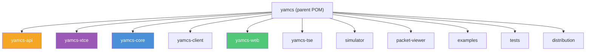
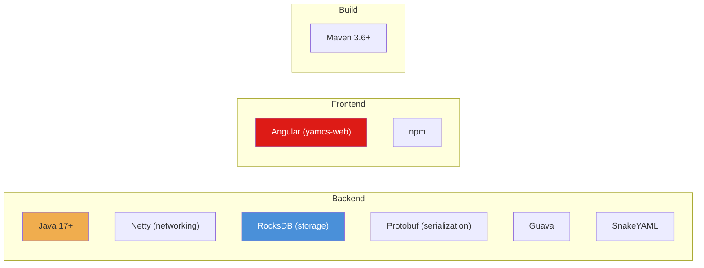

# Yamcs Mission Control — Tổng quan Repository

## 1. Giới thiệu chung

**Yamcs** (Yet Another Mission Control System) là một **framework điều khiển nhiệm vụ vũ trụ (Mission Control)** mã nguồn mở, được phát triển bằng **Java** bởi công ty [Space Applications Services](https://www.spaceapplications.com) (Bỉ).

| Thông tin | Chi tiết |
|---|---|
| **Website** | https://yamcs.org |
| **Phiên bản hiện tại** | `5.12.7-SNAPSHOT` |
| **Ngôn ngữ chính** | Java 17+ |
| **Build tool** | Maven + npm |
| **License** | AGPL v3 (thương mại qua Space Applications Services) |
| **Lịch sử phát triển** | Từ v4.x (2018) đến v5.12.x (2025), rất tích cực |

> [!IMPORTANT]
> Yamcs được thiết kế để **nhận telemetry (TM)** từ tàu vũ trụ, **gửi telecommand (TC)**, lưu trữ dữ liệu, và cung cấp giao diện web để giám sát & điều khiển nhiệm vụ theo thời gian thực.

---

## 2. Kiến trúc Module

Repository là một **Maven multi-module project** với cấu trúc sau:



### Chi tiết từng module

| Module | Mô tả |
|---|---|
| **yamcs-api** | Định nghĩa API sử dụng **Protocol Buffers (protobuf)**. Là lớp giao tiếp giữa client và server. |
| **yamcs-xtce** | Parser và model cho chuẩn **XTCE** (XML Telemetric and Command Exchange) — định nghĩa Mission Database (MDB). |
| **yamcs-core** | ⭐ **Module lõi** — chứa toàn bộ engine xử lý TM/TC, Parameter Archive, Stream SQL, data links, alarm server, replication, CFDP, v.v. |
| **yamcs-client** | Java client library để tương tác với Yamcs server qua API. |
| **yamcs-web** | Giao diện web đưa vào server dưới dạng static bundle. |
| **yamcs-tse** | Hỗ trợ **Test Support Equipment** (thiết bị đo test: oscilloscope, power supply...) qua serial/UDP. |
| **simulator** | Bộ mô phỏng tàu vũ trụ đơn giản — dùng cho demo & phát triển. |
| **packet-viewer** | Công cụ GUI Java Swing để xem và phân tích packet TM. |
| **examples** | Các cấu hình ví dụ minh họa nhiều tính năng. |
| **tests** | Integration tests. |
| **distribution** | Đóng gói và phân phối (RPM, tarball...). |

---

## 3. Tính năng chính

### 🛰️ Telemetry & Telecommand
- Nhận và xử lý **TM packets** qua nhiều giao thức (TCP, UDP, CCSDS frames, serial...)
- Gửi **TC (telecommand)** với hỗ trợ command queuing, clearance, constraint checking
- Hỗ trợ chuẩn **CCSDS** (TM/AOS/USLP frames), **COP-1**, **SDLS** (Space Data Link Security)

### 📊 Lưu trữ & Parameter Archive
- Sử dụng **RocksDB** làm storage engine
- **Parameter Archive** — lưu trữ và truy vấn nhanh giá trị tham số theo thời gian
- **Stream SQL** — ngôn ngữ truy vấn nội bộ cho dữ liệu stream

### 🔒 Bảo mật & Xác thực
- Hỗ trợ nhiều AuthModule: YAML, LDAP, Kerberos/SPNEGO, OIDC
- Quản lý quyền chi tiết (privileges) cho parameters, commands, packets, links

### 📁 File Transfer
- Hỗ trợ giao thức **CFDP** (CCSDS File Delivery Protocol)
- Kiến trúc mở cho các giao thức file transfer khác

### 🔄 Replication & Cascading
- **Replication service** — đồng bộ dữ liệu giữa các Yamcs instance
- **Cascading** — kết nối upstream/downstream Yamcs servers
- Mirror alarm status qua replication

### 🌐 Web Interface (yamcs-web)
- Giao diện web hiện đại cho monitoring & control
- Command stacks, alarm management, event filtering
- Archive browser, parameter plots, timeline
- Hỗ trợ **web extensions** cho plugins

### ⚙️ Mở rộng
- Kiến trúc **plugin-based** — mở rộng qua Java classes tùy chỉnh
- Cấu hình qua **YAML files**
- Hỗ trợ scripting: JavaScript (Nashorn), Python (Jython), Java expressions
- Algorithms framework cho xử lý dữ liệu tùy chỉnh

---

## 4. Các ví dụ đi kèm

Thư mục `examples/` chứa 13 cấu hình mẫu:

| Ví dụ | Mô tả |
|---|---|
| `simulation` | 🚀 Demo chính — mô phỏng tàu vũ trụ hạ cánh, nhận TM + gửi TC |
| `ccsds-frames` | Xử lý CCSDS TM/TC frames |
| `ccsds-frames-sdls` | CCSDS frames với SDLS (AES-256-GCM encryption) |
| `cfdp` / `cfdp-udp` | File transfer qua CFDP |
| `cascading` | Kết nối upstream/downstream servers |
| `replication1/2/3` | Các kịch bản replication khác nhau |
| `pus` | Packet Utilization Standard (ECSS) |
| `perftest1/2` | Benchmark hiệu năng |
| `templates` | Instance templates |

---

## 5. Technology Stack



### Dependencies chính
- **Netty 4.1.x** — HTTP server & networking
- **RocksDB 9.4.x** — Embedded key-value storage
- **Protobuf 3.25.x** — API serialization
- **Guava 33.x** — Utility libraries
- **SLF4J** — Logging
- **Nashorn / Jython** — Scripting engines
- **JUnit 5 + Mockito** — Testing

---

## 6. Cách chạy nhanh

```bash
# Build Java
mvn clean install -DskipTests

# Build web interface  
cd yamcs-web/src/main/webapp
npm install && npm run build
cd -

# Chạy simulation demo
./run-example.sh simulation
# Hoặc trên Windows:
run-example.cmd simulation

# Mở trình duyệt → http://localhost:8090
```

> [!NOTE]
> **Windows users**: Cần bật Developer Mode và `git config --global core.symlinks true` để hỗ trợ symbolic links trong repo.

---

## 7. Tóm tắt

Yamcs là một hệ thống mission control **chuyên nghiệp, production-ready** được sử dụng trong ngành hàng không vũ trụ thực tế. Repository này chứa toàn bộ source code của server core, web interface, và các công cụ đi kèm. Với kiến trúc modular và khả năng mở rộng cao qua plugins + YAML config, Yamcs có thể được tùy biến cho nhiều loại nhiệm vụ vũ trụ khác nhau — từ lab testing (EGSE) đến điều khiển vệ tinh thực tế.
